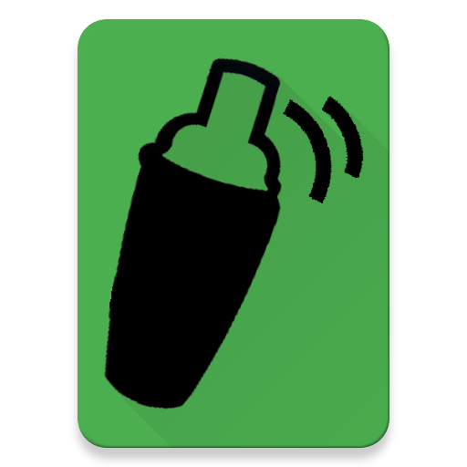
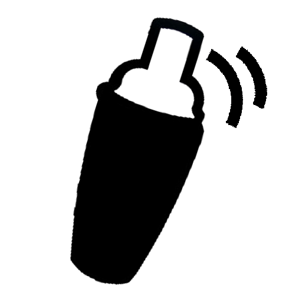
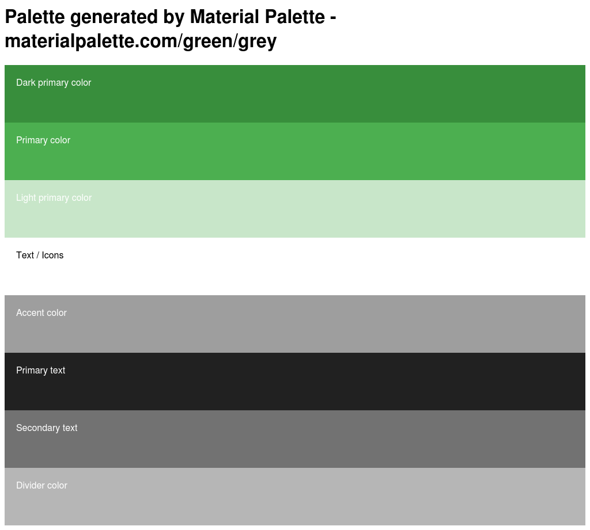

# Documentation for Verbshaker
## Readme
Readme-Datei des Projects:
[README](readme.html "Link")

## REST
[RAML](api.html "Link")

## JSDoc
[JSDoc](jsdoc/index.html "Link")

## Test
[Unit-Tests](mochawesome-reports/mochawesome.html "Link")
[Load-Tests](loadtest.html "Link")

## Coverage
[Code-Coverage by Istanbul](coverage/lcov-report/index.html "Link")

## Resources
### Logo

### Color Palette

